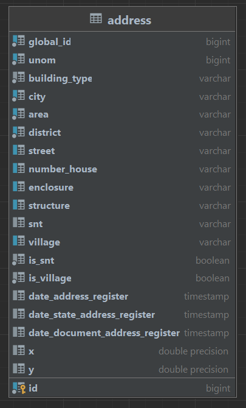

### Данный сервис написан с использованием языка программирования Java 17, в нём использованы технологии такие как:
- Spring Boot Web - фреймворк для создания веб сервера
- Spring Boot Data Jpa - фреймворк для работы с базами данных
- Spring Boot OpenFeign - фреймворк для взаимодействия с другими службами по RESTFull
- MapStruct - библиотека для преобразования Dto в Entity и обратно
- FlywayDB - библиотека для версионирования изменений в БД
- ApachePOI - библиотека для работы с файлами Excel

Данный сервис взаимодействует с БД на PostrgeSQL, которая содержит данные таблицы:

